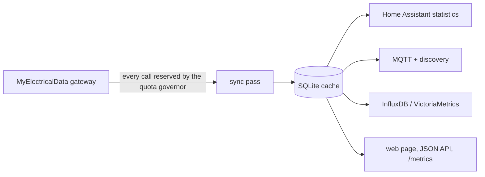

# releve

[](https://github.com/ngsanogo/releve/actions/workflows/ci.yml)
[](https://github.com/ngsanogo/releve/actions/workflows/codeql.yml)
[](https://github.com/ngsanogo/releve/releases)
[](LICENSE)
[](pyproject.toml)

*releve* (from *relevé*, a meter reading) keeps a complete local history of a
French electricity meter and feeds it to Home Assistant, MQTT and
InfluxDB/VictoriaMetrics.

Readings come from the [MyElectricalData](https://www.myelectricaldata.fr)
gateway, which publishes yesterday's data once a day and allows 50 calls per
meter per day. So releve is built around one small data-engineering problem:
fetch each day exactly once, never waste the budget, store everything locally,
and let every consumer read from that local copy. It tries to stay simple,
reproducible and pleasant to maintain — one process, one SQLite file, one
configuration file.

## How it works



- **The quota is never overspent.** Each gateway call is reserved in the
  database before it is sent, in the same transaction that checks the daily
  budget — even when a manual `sync` and the daemon run at the same time. An
  upstream throttle becomes a persisted block; nothing retries in a loop.
- **The history stays complete.** Each pass fetches every missing day of the
  history window, newest first. A load-curve day published only partially is
  asked for again until its curve is complete. A day still empty a week later
  becomes a confirmed gap; a curve day still incomplete after a week is kept
  as it is (exporters fall back to the daily total).
- **The cache never forgets.** Incomplete answers are upserted, never used to
  erase a fuller day. A complete load-curve answer replaces that day's points.
- **Exports resume where they stopped.** Each exporter keeps a cursor on the
  cache, so a destination that was down catches up on its next run.
- **Home Assistant series can be continued.** An existing statistic series is
  extended after its last point, without touching what came before
  ([details](#home-assistant)).
- **Everything stays local.** releve only talks to the gateway and to the
  exporters you enable.

Want real-time readings instead? A TIC reader (Zigbee or ESPHome teleinfo
module) plugged into the meter is the better tool; releve is about complete
history without extra hardware.

## Quickstart

With Docker (amd64 and arm64 images):

```bash
docker run --rm ghcr.io/ngsanogo/releve:latest init --stdout > config.yaml
chmod 600 config.yaml            # then set gateway.token and your PDL
docker compose up -d             # see docker-compose.yaml
```

Or with Python 3.12+:

```bash
uv tool install git+https://github.com/ngsanogo/releve@v0.1.0
releve init                      # writes ~/.config/releve/config.yaml
$EDITOR ~/.config/releve/config.yaml   # set gateway.token and your PDL
releve check                     # explains the configuration
releve sync                      # one pass now
releve serve                     # the daemon, with http://127.0.0.1:8080
```

## Configuration

One YAML file — `releve init` writes a commented one — where every key can be
overridden from the environment: `RELEVE_` prefix, `__` between levels, e.g.
`RELEVE_GATEWAY__TOKEN`. The file is `--config`, else `$RELEVE_CONFIG`, else
`~/.config/releve/config.yaml`. The database is `storage.path`, by default
`~/.local/state/releve/releve.db`. Unknown keys are errors, so typos never go
unnoticed.

```yaml
gateway:
  token: "…"                    # from myelectricaldata.fr
usage_points:
  - id: "01234567890123"        # your PDL, quoted
    consumption: true           # daily energy
    consumption_detail: true    # 30-minute load curve
    max_power: true
sync:
  history_days: 365
exporters:
  home_assistant:
    enabled: true
    url: "ws://homeassistant.local:8123/api/websocket"
    token: "…"
```

## Exporters

| Exporter | Delivers |
|---|---|
| `home_assistant` | Long-term statistics `releve:<pdl>_consumption` / `_production` (kWh), for the Energy dashboard |
| `mqtt` | Retained JSON state (yesterday, last 7 and 30 days, peak power, Tempo, Ecowatt) with Home Assistant discovery |
| `influxdb` | Influx line protocol on `/api/v2/write`, for InfluxDB v2 and VictoriaMetrics |

### Home Assistant

Statistics are written hour by hour. A day whose load curve is complete gets its
measured hourly energy; any other day stays flat until 23:00, where the day's
total lands — a daily total is only known once the day is over.

To **continue a series** another integration started, set `statistic_id` to its
id. On the first export releve reads the last point Home Assistant holds for it
and pins it locally as the series' *boundary*: it appends after it and continues
its sum. Each series belongs to one usage point. `releve ha-boundary` shows the
pinned boundaries and can set one explicitly, for instance after restoring a
database — the next export then rewrites everything after it. As with any tool
writing to your statistics, a Home Assistant backup beforehand is a good habit.

## Home Assistant integration (HACS)

The repository is also a [HACS](https://hacs.xyz) integration. It reads
releve's JSON API and shows what the cache knows as native sensors — no MQTT
broker needed:

- per usage point: energy of yesterday and of the last 7 and 30 days, peak and
  off-peak energy of yesterday, production, yesterday's max power; as
  diagnostics, the latest published day, the last successful sync, consent
  expiry, gateway calls, and the contract's subscribed power, tariff and
  off-peak hours;
- a *Grid signals* device: today's Tempo color and Ecowatt level, and the
  Tempo days left in the season.

A sensor exists when releve publishes its value — a dataset turned off in
releve has no sensor — and a value releve cannot state truthfully (yesterday
not published yet, a week with a missing day) is *unknown*, never zero.

Install: HACS → ⋮ → *Custom repositories* → `https://github.com/ngsanogo/releve`,
category *Integration*; download *releve*, restart Home Assistant, then
*Settings → Devices & services → Add integration → releve*, with releve's
address (for instance `http://127.0.0.1:8080` on the same host) and its
`web.auth_token` if it has one. A refused token opens a re-authentication
prompt.

The integration and the releve server share their version: install the release
matching the server. Long-term statistics for the Energy dashboard stay with
the [`home_assistant` exporter](#home-assistant) — the integration's rolling
totals are deliberately not statistics.

## Web interface and API

`releve serve` runs the sync passes and a small read-only web page: freshness,
days still to fetch, quota, exports and the journal. It also serves:

- `GET /api/v1/usage-points` — the configured usage points, their datasets and last successful sync
- `GET /api/v1/usage-points/{pdl}/state`, `GET /api/v1/rte/state` — the state MQTT publishes
  (the latter 404 when `sync.rte_signals` is off)
- `GET /api/v1/usage-points/{pdl}/daily?start=YYYY-MM-DD&end=YYYY-MM-DD[&direction=production]`
- `GET /api/v1/usage-points/{pdl}/curve?start=…&end=…[&direction=]`
- `GET /api/v1/usage-points/{pdl}/max-power?start=…&end=…`
- `GET /api/v1/usage-points/{pdl}/consent|contract|identity|contact|address` — customer data only
  while enabled for the usage point
- `GET /api/v1/rte/tempo?start=…&end=…`, `/ecowatt`, `/ecowatt/hours`, `/tempo/season`, `/tempo/prices`
- `GET /metrics` (Prometheus) — `releve_last_success_timestamp_seconds` is the one to alert on
- `GET /healthz` — 503 when the database is unusable, the scheduler stalled or the last pass crashed

It listens on `127.0.0.1` by default (`0.0.0.0` inside the container, where the
published port decides). Set `web.auth_token` to require a token on every route
but `/healthz` — as a Bearer token, or as the password of HTTP Basic
authentication so browsers work too.

An importable Grafana dashboard for the Influx exporter lives in
[`contrib/grafana/releve-influx.json`](contrib/grafana/releve-influx.json).

## Command line

```
releve init          write a commented configuration file
releve check         validate the configuration and explain it
releve sync          run one sync pass now
releve status        freshness, days still to fetch, quota, exports
releve serve         the daemon and the web interface
releve ha-boundary   show or set Home Assistant series boundaries
releve purge-cache   delete MyElectricalData's remote cache for a PDL
releve version
```

Exit status: 0 success, 1 the pass completed with failures, 2 invalid
configuration or database, 3 another pass is already running.

## Development

```bash
uv sync                          # dependencies, including the dev group
uv run pytest                    # tests
uv run ruff check src tests custom_components tests_ha
uv run ruff format --check src tests custom_components tests_ha
uv run mypy                      # strict

# The Home Assistant integration, in its own environment (Home Assistant pins its libraries):
uv venv --python 3.14 .venv-ha && uv pip install --python .venv-ha -r tests_ha/requirements.txt
.venv-ha/bin/python -m mypy --config-file tests_ha/mypy.ini custom_components/releve
(cd tests_ha && ../.venv-ha/bin/python -m pytest)
uvx pre-commit install           # optional: ruff and gitleaks before each commit
```

The design is written down in [docs/architecture.md](docs/architecture.md) and
the [ADRs](docs/adr). Contributions are welcome, in English or French — see
[CONTRIBUTING.md](CONTRIBUTING.md).

## License

[Apache-2.0](LICENSE).
